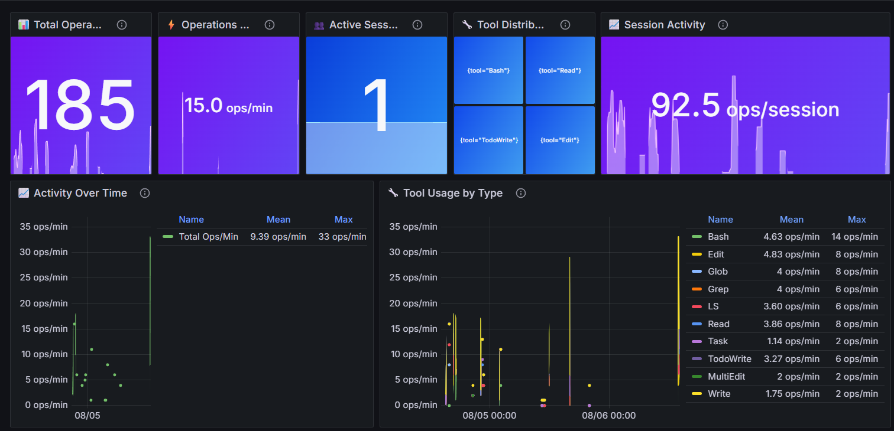
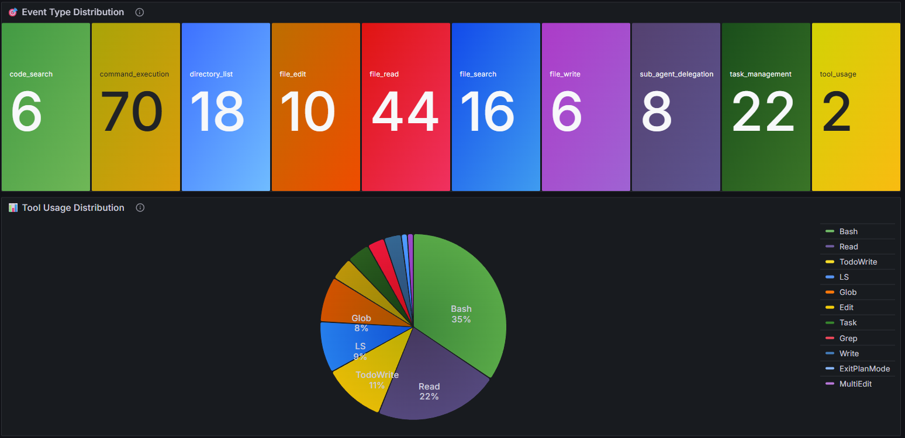
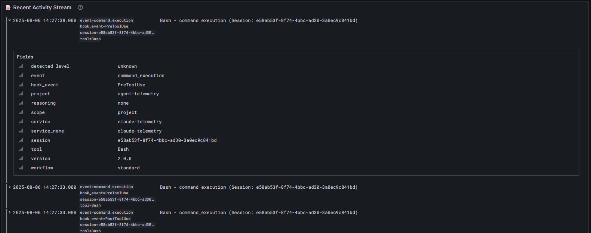

# Claude Agent Telemetry

> **Production-ready monitoring for [Claude Code](https://claude.ai/code) AI development workflows**  
> Real-time telemetry, security analysis, and ML-powered behavioral insights for solo developers

[](#quick-start)
[](#requirements)
[](LICENSE)
[](docs/claude-agent-telemetry.md)

## 🎯 What Is This?

**Claude Code** is Anthropic's official CLI that lets you work with Claude AI directly from your terminal. This telemetry system **monitors your Claude Code usage** to help you:

- **📊 Understand your AI workflow** - Which tools do you use most? How efficient are your patterns?
- **🔍 Optimize productivity** - Identify bottlenecks, track improvements, analyze delegation patterns  
- **🛡️ Monitor security boundaries** - Detect when Claude accesses files outside your project scope
- **🧠 Learn from behavioral insights** - ML-powered analysis of your development patterns over time

**Perfect for**: Solo developers, small teams, anyone wanting visibility into their Claude Code workflows  
**Not for**: Enterprise security auditing, complex multi-tenant environments

## ✨ Features

- **🔍 Complete Activity Monitoring** - Every Claude tool usage captured and analyzed
- **🛡️ Security Boundary Enforcement** - Real-time detection of out-of-scope access
- **🧠 ML-Powered Analytics** - Behavioral pattern analysis with anomaly detection
- **📊 Live Dashboards** - Real-time Grafana visualizations with 34K+ data points
- **🚀 Zero-Config Setup** - One command installation with automatic dependency management
- **🔗 Multi-Project Support** - Monitor unlimited projects from central installation

## 🚀 Quick Start

```bash
# 1. Clone and setup (one command!)
git clone https://github.com/D9kej5892KfW/Calcutta-multi.git claude-telemetry
cd claude-telemetry
npm run setup

# 2. Start monitoring
npm start

# 3. Open dashboard
npm run dashboard
```

**That's it!** Your Claude Code activity is now being monitored in real-time.

## 📦 What You Get

### **Instant Setup**
- ✅ **Automated dependency installation** (Python, system tools)
- ✅ **Pre-built binaries** (Loki, Grafana) - no compilation needed
- ✅ **Health validation** - comprehensive system checks
- ✅ **Claude Code integration** - automatic hook configuration

### **Production Features**
- ✅ **34K+ telemetry entries** processed and analyzed
- ✅ **Sub-second queries** with efficient data storage (7.2MB for full dataset)
- ✅ **Real-time dashboards** with customizable time windows
- ✅ **Security monitoring** with 12+ detection rules
- ✅ **Cross-platform** Linux and macOS support

## 📸 See It In Action


*Real-time monitoring of Claude Code tool usage and performance metrics*

  
*Security boundary detection and behavioral analysis*


*ML-powered insights and productivity patterns*

## 📋 Commands

### **npm Interface (Recommended)**
| Command | Description |
|---------|-------------|
| `npm run setup` | **One-time setup** - installs everything automatically |
| `npm start` | **Start monitoring** - Loki + Grafana services |
| `npm stop` | **Stop monitoring** - clean shutdown |
| `npm run dashboard` | **Open Grafana** - launches browser to dashboard |
| `npm run connect` | **Connect project** - add current directory to monitoring |
| `npm run status` | **Check health** - validate all services |
| `npm run logs` | **Live stream** - watch telemetry in real-time |
| `npm run health` | **Health check** - comprehensive system validation |
| `npm test` | **End-to-end test** - validate complete data flow |

### **Direct CLI Interface**
```bash
# Core operations
./scripts/claude-telemetry setup              # Complete system setup
./scripts/claude-telemetry start              # Start monitoring services
./scripts/claude-telemetry stop               # Stop all services
./scripts/claude-telemetry status             # Check system health
./scripts/claude-telemetry dashboard          # Open Grafana dashboard

# Project management
./scripts/claude-telemetry connect [path]     # Connect project to telemetry
./scripts/claude-telemetry disconnect [path]  # Disconnect project
./scripts/claude-telemetry projects           # List connected projects

# Analytics & maintenance
./scripts/claude-telemetry analytics          # Process ML data
./scripts/claude-telemetry backup             # Backup telemetry data
./scripts/claude-telemetry cleanup            # Clean logs
./scripts/claude-telemetry alerts start       # Start alert engine

# Advanced usage
./scripts/claude-telemetry --help             # Show all commands
./scripts/claude-telemetry --dry-run status   # Preview actions
```

## 🏗️ Architecture

```
┌─────────────────┐    ┌──────────────────┐    ┌─────────────────┐
│   Claude Code   │───▶│  Telemetry Hook  │───▶│  Loki Storage   │
│   Tool Usage    │    │  (Pre/Post Tool) │    │  + Local Backup │
└─────────────────┘    └──────────────────┘    └─────────────────┘
                                                        │
                                                        ▼
┌─────────────────┐    ┌──────────────────┐    ┌─────────────────┐
│    Grafana      │◀───│  Query Engine    │◀───│   Loki Server   │
│   Dashboard     │    │  (LogQL/HTTP)    │    │   (Port 3100)   │
└─────────────────┘    └──────────────────┘    └─────────────────┘
```

**Data Flow**: Claude Tool → Hook → Loki → Grafana → Insights

## 📊 Monitoring Capabilities

### **Tools Monitored**
- **File Operations**: `Read`, `Write`, `Edit`, `MultiEdit`
- **Command Execution**: `Bash`, shell commands with arguments
- **Code Analysis**: `Grep`, `Glob`, search patterns
- **AI Operations**: `Task` delegation, `WebFetch`, `WebSearch`
- **Task Management**: `TodoWrite`, progress tracking

### **Security Features**
- **Boundary Detection**: Flags access outside project scope
- **Command Monitoring**: Captures all shell executions
- **Session Tracking**: Correlates activities by session ID
- **Risk Scoring**: ML-based behavioral analysis

### **Analytics Pipeline**
- **Real-time Processing**: Live telemetry ingestion
- **Feature Extraction**: 16+ behavioral patterns
- **Anomaly Detection**: Isolation Forest models
- **Trend Analysis**: Historical pattern recognition

## 🌐 Dashboards

Access comprehensive monitoring at **http://localhost:3000** (admin/admin):

- **📈 Performance Dashboard** - Tool usage, response times, activity rates
- **🔒 Security Dashboard** - Boundary violations, command patterns, risk alerts
- **🧠 Analytics Dashboard** - Behavioral insights, anomaly detection, trends
- **📊 System Dashboard** - Service health, data processing, storage metrics

## 🔧 Advanced Usage

### **Multi-Project Monitoring**
```bash
# Connect any project to telemetry
cd /path/to/your-project
npm run connect

# List all monitored projects
npm run status

# View project-specific data in Grafana
# Filter: project="your-project-name"
```

### **Custom Queries**
```bash
# All activity for a specific project
curl -G "http://localhost:3100/loki/api/v1/query_range" \
  --data-urlencode 'query={service="claude-telemetry", project="my-project"}'

# Security violations
curl -G "http://localhost:3100/loki/api/v1/query_range" \
  --data-urlencode 'query={service="claude-telemetry"} |= "outside_project_scope.*true"'
```

### **Data Export**
```bash
# Export telemetry data
cp data/logs/claude-telemetry.jsonl /path/to/backup/

# Analytics data
tar -czf telemetry-backup.tar.gz data/analytics/
```

## 🛠️ Troubleshooting

### **Setup Issues**
```bash
npm run health     # Comprehensive health check
npm run validate   # Validate installation
npm run setup      # Re-run setup if needed
```

### **Service Issues**
```bash
npm run status     # Check service status
npm restart        # Restart all services
npm run logs       # View live telemetry
```

### **Common Problems**

| Problem | Solution |
|---------|----------|
| "Loki not ready" | `npm restart` |
| "Missing dependencies" | `npm run setup` |
| "Permission denied" | `chmod +x scripts/*.sh` |
| "Python import error" | Check virtual environment: `source venv/bin/activate` |

## 📋 Requirements

### **Prerequisites**
- **[Claude Code](https://claude.ai/code) installed and working** - This is what we monitor!
- **Linux or macOS** - Windows support coming soon
- **Internet connection** - For initial setup only

### **Automatic (handled by setup)**
- Python 3.8+ with pip
- System tools: `curl`, `jq`  
- ~1.6GB disk space

> **New to Claude Code?** Get started at [claude.ai/code](https://claude.ai/code) - it's Anthropic's official CLI for AI-powered development.

## 🔐 Security & Privacy

- **Local-only**: All data stays on your machine
- **No external transmission**: Zero network dependencies after setup
- **Metadata-only**: Tool usage patterns, not file contents
- **Configurable**: Easy enable/disable per project
- **Audit trail**: Complete activity history for compliance

## 📖 Documentation

- **Setup Guide**: This README
- **Architecture Deep-dive**: `docs/claude-agent-telemetry.md`
- **Dashboard Guide**: `docs/dashboard/`
- **API Reference**: Loki LogQL and HTTP API documentation

## 🚀 Getting Started

1. **Install Claude Code** (if you haven't): Visit [claude.ai/code](https://claude.ai/code)
2. **Clone this repo**: `git clone https://github.com/D9kej5892KfW/Calcutta-multi.git`
3. **Run setup**: `npm run setup` 
4. **Start monitoring**: `npm start`
5. **Open dashboard**: `npm run dashboard`

## 🤝 Contributing

1. Fork the repository
2. Create feature branch: `git checkout -b feature-name`
3. Test changes: `npm test`
4. Submit pull request

## 📄 License

MIT License - see [LICENSE](LICENSE) file for details.

---

## 💡 Pro Tips

- **Use `npm run logs`** to watch live telemetry during development
- **Filter by project** in Grafana: `{project="your-project-name"}`
- **Health checks** are your friend: `npm run health` for quick diagnostics
- **Export data** regularly for long-term analysis and backup

**Ready to monitor your Claude Code activities like a pro? Run `npm run setup` and get started in under 2 minutes!** 🚀